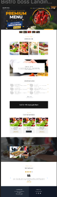
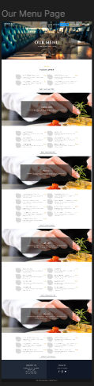
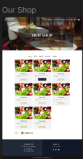

# [https://my-restaurant-seven-tau.vercel.app/](https://my-restaurant-seven-tau.vercel.app/)

# Using Technologies
<ul>
<li>React</li>
<li>React Router</li>
<li>Tailwind CSS</li>
<li>Daisy UI</li>
<li>awesome react components </li>
<li>awesome font icons </li>
</ul>
## Expanding the ESLint configuration

If you are developing a production application, we recommend using TypeScript with type-aware lint rules enabled. Check out the [TS template](https://github.com/vitejs/vite/tree/main/packages/create-vite/template-react-ts) for information on how to integrate TypeScript and [`typescript-eslint`](https://typescript-eslint.io) in your project.
